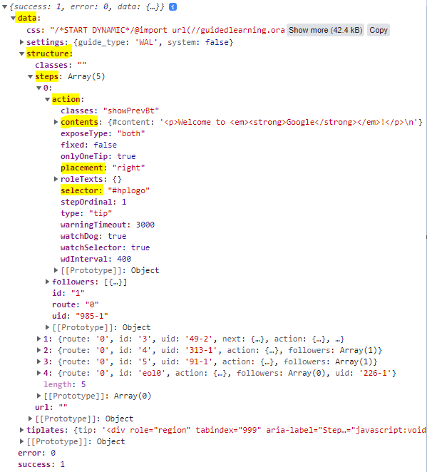

# Minified-guided-learning-solution-GLS-
GLS is a solution that enables step by step guidance on top of any web interface.
I build a guided learning frontend engine written in javascript. Player that will eventually run a guide on google.com. 

***JSONP Json guid*** - The json represents a sample guide that the frontend engine will need to render on the google.com. A guide is a sequence of steps, each step represents a specific tooltip with a specific text on a specific element in the page.

I implemented player.js  - so that upon loading google.com in a browser the sample guide will run and display tooltip on the screen.
The script I wrote can be injected into google using DevTools. 

The Guide URL I used look like this:

The given url im my code return JSON tag delivers data directly to a first-party page in JSON format.
We can see that that data contains an array of 5 elements. 
The first element array for example contains the 'contents' which I used its contents for presentation in the tooltip.  
Moreover, I coult use 'selector' to "find" (or select) the HTML elements I want to style. 

I recommend using this site to see the information returned in a more structured way [jsonformatter](https://jsonformatter.org/json-pretty-print).
